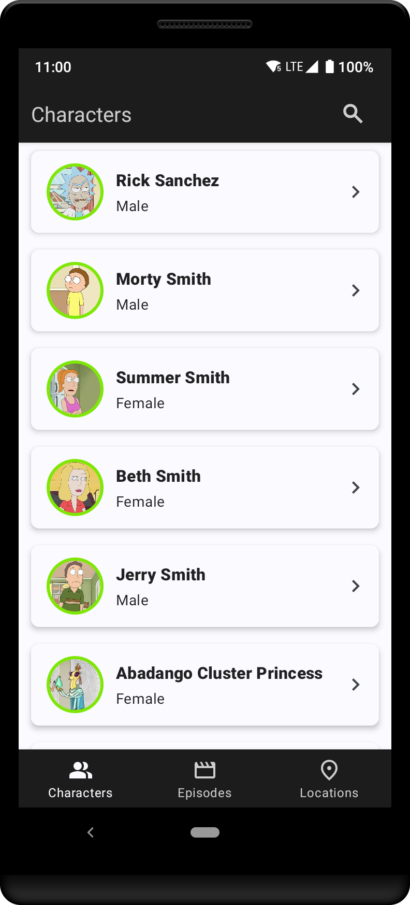
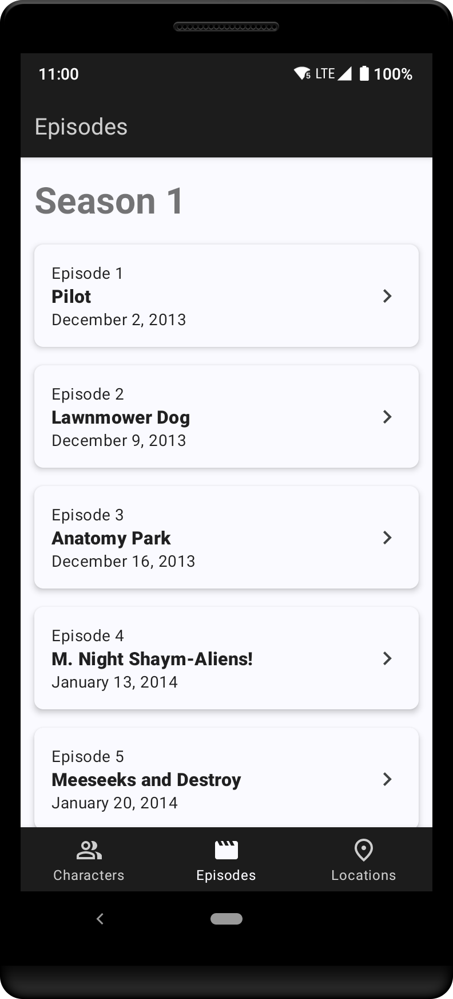
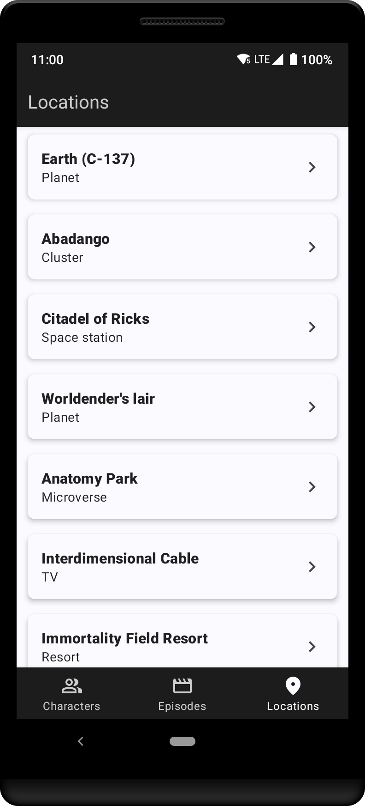

# Rick and Morty Hub

**Rick and Morty Hub** is your passport to the quirky and exciting universe of Rick and Morty, brought to life as an Android app built with Kotlin. 
This app harnesses the power of the Rick and Morty API, allowing you to effortlessly list, filter, and explore characters, episodes, and locations from the show.

## Features
- **Character Catalog**: Explore a rich ensemble of characters from the Rick and Morty universe and delve into their extensive details.
- **Filtering**: Effortlessly narrow down your character search using various filters to find exactly who you're looking for.
- **Episode Guide**: Access a comprehensive list of episodes and immerse yourself in their detailed descriptions.
- **Locations List**: Discover all the distinct locations from the Rick and Morty series and explore the residents inhabiting them, providing an immersive insight into the show's diverse settings.

## Screenshots
| Characters | Episodes | Locations |
| --- | --- | --- |
|  |  |  |
| *Characters List* | *Episodes List* | *Locations List* |

## Architecture
- **Clean Architecture**: The app follows Clean Architecture principles for robust and maintainable code.
- **MVVM Architecture**: Employs the MVVM architecture pattern for a structured and organized presentation layer.

More details coming soon 🔃

## Tech Stack

### Libraries
- ViewBinding
- Hilt for dependency injection
- Paging 3 for efficient data loading
- Flow for asynchronous data flow
- Picasso for image loading
- Android KTX for Kotlin extensions
- Retrofit for seamless API communication

### Testing
- JUnit 4 for unit testing
- MockK for mocking in test cases

### Debugging
- Flipper for enhanced debugging capabilities
